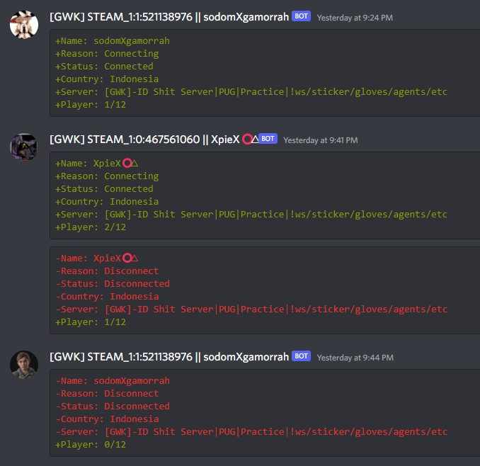
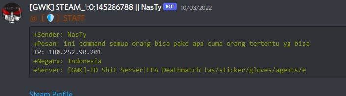
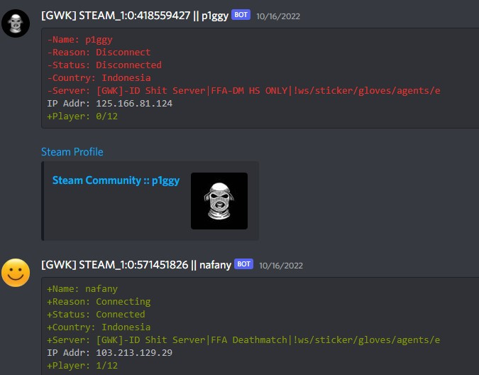
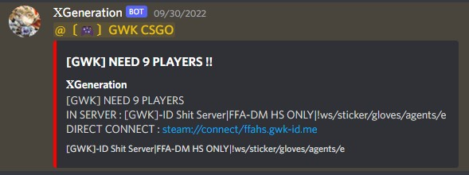

# conn-logs
Connection logs for CSGO Server

## Install Guide
- Copy `include`,`discord`,`dcLogger.sp` To `csgo/addons/sourcemod/scripting/`
- Copy `dcLogger.smx` To `csgo/addons/sourcemod/plugins/`

## Screen shoot
PUBLIC CONNECTION LOG EXAMPLE:

	

REPORT/FEEDBACK (!min [your msg] / !gan [your msg] ) LOG EXAMPLE:

	

ADMIN ONLY CONNECTION LOG EXAMPLE:

	

(!nd / !need) COMMAND EXAMPLE:

	

